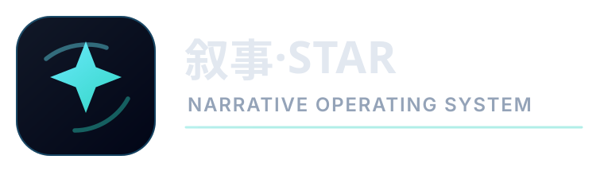
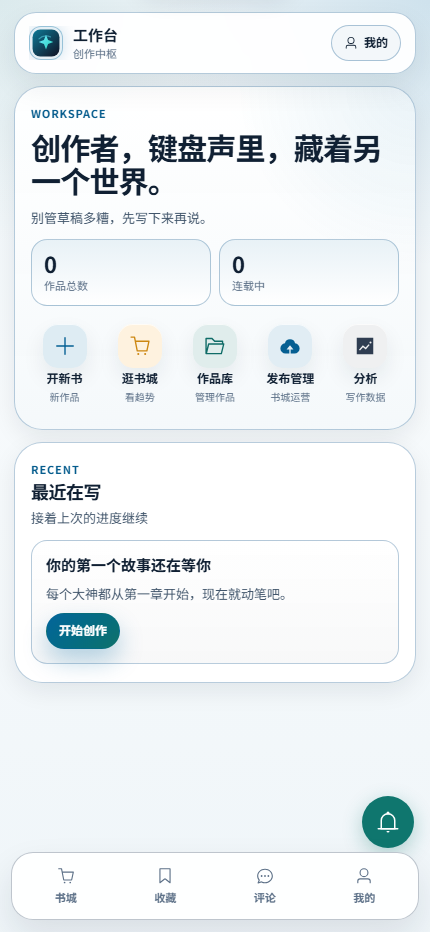
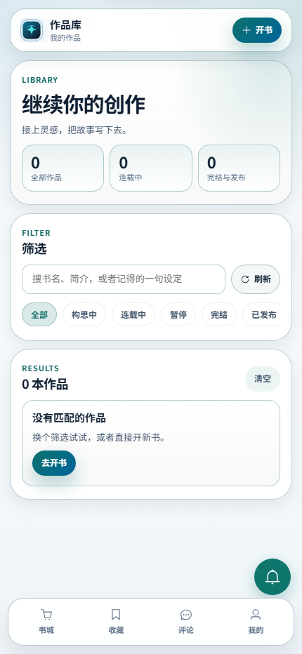
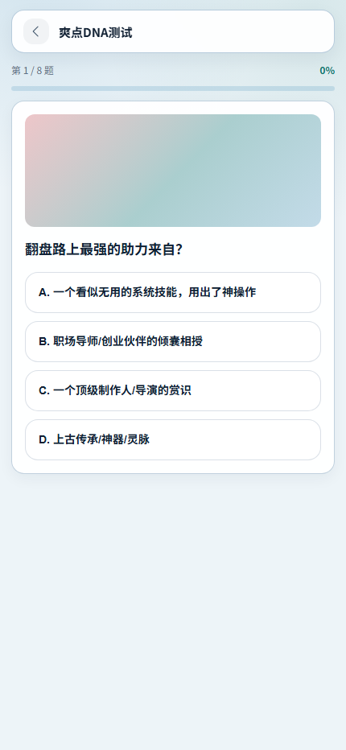
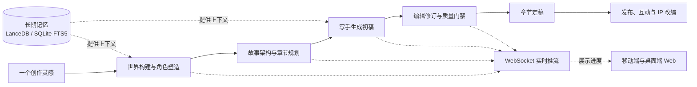
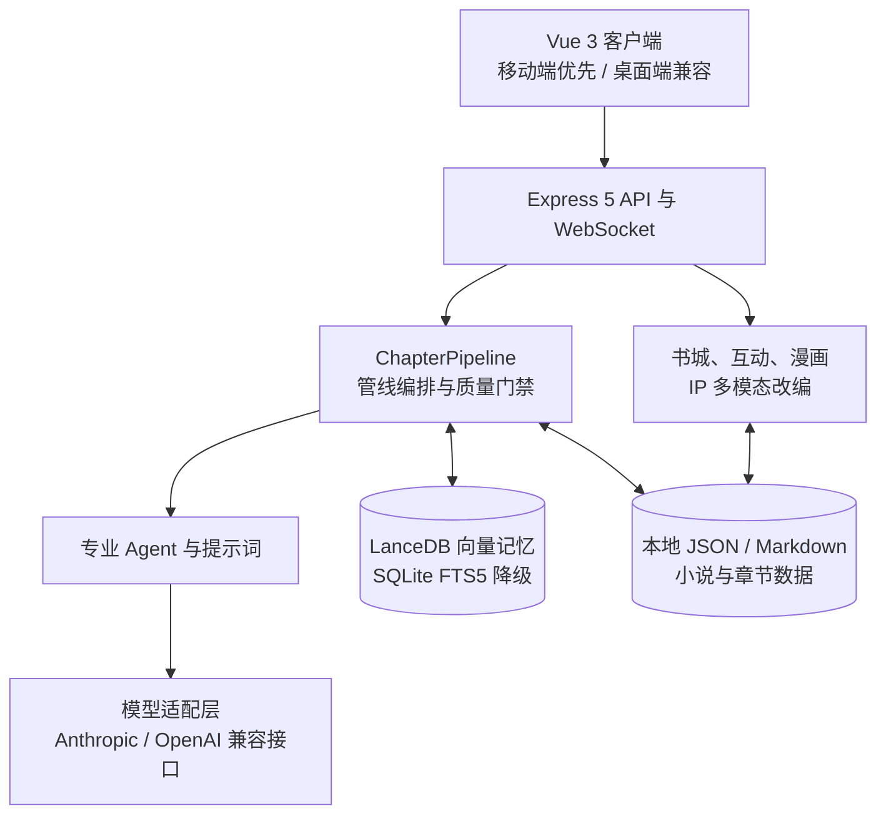

# 叙事·STAR

<p align="center">
  <picture>
    <source media="(prefers-color-scheme: dark)" srcset="web/public/brand/logo-horizontal-light.svg">
    <source media="(prefers-color-scheme: light)" srcset="web/public/brand/logo-horizontal-dark.svg">
    
  </picture>
</p>

<p align="center">
  <strong>自托管的多 Agent 中文长篇小说创作工坊</strong>
</p>

<p align="center">
  从一个灵感出发，完成世界观、人物、大纲、章节、质检与读者互动。模型密钥在你手中，小说数据留在你自己的机器上。
</p>

<p align="center">
  <a href="https://github.com/cikongjian/novel-workshop/actions/workflows/verify.yml"></a>
  <a href="LICENSE"></a>
  
  
</p>

<p align="center">
  <a href="https://m.xsstar.cn/m">在线体验</a> · <a href="https://blog.xsstar.cn/">作者博客</a> · <a href="#快速开始">快速开始</a> · <a href="#核心能力">核心能力</a> · <a href="#架构">架构</a> · <a href="#在线体验与联系">联系作者</a> · <a href="SECURITY.md">安全说明</a>
</p>

---

## 这是什么

叙事·STAR 不是内容分发平台，而是一套可部署在自己设备上的创作工作台。它把长篇小说中需要反复往返的策划、起草、修订与质量控制，组织为可以观察、调整和扩展的多 Agent 工作流。

你可以接入自己的模型供应商和 API Key；创作素材、章节、人物与记忆索引默认保存在本地文件系统。适合希望保有内容与工作流控制权的作者、创作团队，以及研究长文本 Agent 编排的开发者。

| 从灵感到作品 | 让长篇写作保持一致 | 面向读者的延展 |
| :--- | :--- | :--- |
| 一句话开书、世界观、角色、大纲、批量章节生成 | 世界观契约、人物稳定性、AI 腔检测、情绪与商业价值门禁 | 书城发布、角色信箱、投票、分叉宇宙、AI 番外与划线批注 |

## 产品界面

以下界面来自全新数据目录运行的生产构建，展示移动端优先的核心体验。

<table>
  <tr>
    <th align="center">移动创作工作台</th>
    <th align="center">作品库</th>
    <th align="center">爽点 DNA</th>
  </tr>
  <tr>
    <td align="center"></td>
    <td align="center"></td>
    <td align="center"></td>
  </tr>
  <tr>
    <td>从开书、创作到发布与分析，集中查看作品进度。</td>
    <td>按创作状态筛选和管理长篇项目，随时回到写作现场。</td>
    <td>用互动测试提炼阅读偏好，并把结果衔接到新书创作。</td>
  </tr>
</table>

## 创作如何流动



## 核心能力

### 一条完整的创作主线

- **章节管线**：世界构建师、角色塑造师、故事架构师、写手、编辑与读者等 Agent 协同工作，生成过程通过 WebSocket 实时推送。
- **从一句话开书**：围绕一个创意自动产出书名、世界观、角色、大纲和首章，也支持按章节批量生成。
- **随时回到作品内部**：管理人物档案、世界观要素、势力体系与力量规则；对章节进行全文润色或定点修复。
- **有记忆的长文本生成**：优先使用 LanceDB 维护世界、角色与章节索引；未配置 Embedding 时自动降级为 SQLite FTS5 全文检索。

### 为长篇一致性设计的质量门禁

长篇写作的难点不止是“写出来”，更是让它持续成立。项目内置 20 余项评分与检查能力，覆盖：

| 关注点 | 代表检查 |
| :--- | :--- |
| 世界与角色 | 世界观契约验证、人格稳定性、身份一致性、关系漂移检测 |
| 文字与叙事 | 结构 / 风格 / 情感评分、AI 叙述腔规避、重复微动作检测、开头句式轮换 |
| 读者体验 | 断章钩子、爽点密度、情绪曲线、公式化桥段识别 |
| 特定题材 | 玄幻 / 修仙作品的力量体系门禁 |

### 视觉、多模态与读者互动

- **角色视觉 DNA**：抽取面部、发型、体型与服饰档案，让立绘和漫画有一致的角色依据。
- **封面、立绘与章节漫画**：可生成带正负提示词的封面方案与角色立绘；实验性章节漫画通过剧情挖掘、分镜与提示词工程串联生成。
- **多引擎语音**：支持 Edge、Qwen3、Azure、OpenAI 与 Kokoro TTS。
- **读者不只阅读**：书城、角色信箱、角色动态、剧情投票、抱走分叉、AI 番外和划线批注共同组成可参与的阅读体验。

> 章节漫画默认关闭，需显式开启 `COMIC_CHAPTER_ENABLED`。

## 快速开始

### 前置条件

- Node.js 22 或更高版本
- 一个可用的模型 API Key
- 原生依赖的构建工具链：`better-sqlite3`、`@lancedb/lancedb` 与 `sharp`

| 平台 | 需要安装 |
| :--- | :--- |
| Windows | [Visual Studio Build Tools](https://visualstudio.microsoft.com/visual-cpp-build-tools/)，并选择“使用 C++ 的桌面开发”工作负载 |
| macOS | `xcode-select --install` |
| Linux | `build-essential` 与 `python3` |

### Docker 部署

```bash
git clone https://github.com/cikongjian/novel-workshop.git
cd novel-workshop

cp .env.example .env
# 编辑 .env，至少设置 MODEL_API_KEY
docker compose up -d
```

打开 `http://127.0.0.1:3001` 即可使用。Compose 会为本机访问设置回环 CORS 来源；项目不要求 Redis 或 MySQL 才能启动。

### 本地开发

```bash
git clone https://github.com/cikongjian/novel-workshop.git
cd novel-workshop

npm install
cd web
npm install
cd ..

cp .env.example .env
# 编辑 .env，至少设置 MODEL_API_KEY

npm run dev
cd web
npm run dev
```

后端默认运行在 `3001` 端口，前端 Vite 默认运行在 `5173` 端口。前端会代理 `/api` 与 `/ws`；移动端是默认入口，请访问 `http://localhost:5173/m`。

> PowerShell 可将 `cp` 替换为 `Copy-Item`；Windows CMD 可使用 `copy`。

## 架构



```text
src/
├── agents/        Agent 实现与提示词
├── pipeline/      章节生成、修订、合并与质量门禁
├── models/        多模型供应商与 OpenAI 兼容适配
├── memory/        LanceDB 向量记忆与 SQLite FTS5 降级检索
├── novel/         小说数据、Zod schema 与本地持久化
├── auth/          JWT、bcrypt 与 refresh token 轮转
├── bookstore/     发布、内容审核与举报处理
├── interactive/   信箱、投票、分叉、番外与批注
├── comic/         章节漫画工作流
├── adaptation/    IP 多模态改编
├── server/        Express、WebSocket、路由与中间件
└── cli/           记忆、世界观、生成与数据维护命令

web/src/
├── views/         页面，移动端入口为 Mobile*.vue
├── components/    mobile-entry、mobile-focus、bookstore 等组件
├── composables/   可复用组合式逻辑
└── config/        品牌配置读取层
```

数据流为：**前端 → REST API → `ChapterPipeline` 调度 Agent → WebSocket 推流 → `NovelManager` 写入 JSON / Markdown**。小说数据无需依赖外部数据库，也能被直接查看、备份或用 Git 管理。

## 模型与配置

支持 Anthropic、OpenAI、DeepSeek、通义千问、智谱、Moonshot、豆包、百川、阶跃星辰、MiniMax、硅基流动、Ollama，以及任意 OpenAI 兼容接口。Anthropic 使用专用 SDK，其余供应商复用 OpenAI 兼容客户端。

完整配置请查看 [`.env.example`](.env.example)。常用变量如下：

| 变量 | 用途 | 默认值 |
| :--- | :--- | :--- |
| `MODEL_PROVIDER` | 选择模型供应商 | `deepseek` |
| `MODEL_API_KEY` | 模型 API Key | 必填 |
| `MODEL_NAME` | 使用的模型名称 | `deepseek-chat` |
| `MODEL_BASE_URL` | 自定义 OpenAI 兼容接口地址 | 留空使用供应商默认地址 |
| `EMBEDDING_PROVIDER` | 向量记忆的 Embedding 供应商 | 可选，留空自动降级 |
| `DATA_DIR` | 小说与记忆数据目录 | `./data` |
| `AUTH_ENABLED` | 是否启用认证 | `false` |
| `AUTH_ADMIN_PASSWORD` | 首次启动时创建管理员的强口令 | 本地可留空；公网认证模式必填 |
| `AUDIOBOOK_ACCESS_MODE` | 服务端 TTS 访问范围 | `admin` |
| `COMIC_CHAPTER_ENABLED` | 是否启用章节漫画 | `false` |

## 公网部署前必须完成的事

默认配置面向本地单人创作，`AUTH_ENABLED=false` 时服务**没有鉴权保护**。将服务公开到网络前，至少应设置：

```bash
AUTH_ENABLED=true
AUTH_JWT_SECRET=<至少 32 个字符的随机值>
AUTH_ADMIN_PASSWORD=<至少 12 个字符的强口令>
USER_API_ENCRYPTION_SECRET=<至少 32 个字符、与 JWT 不同的随机值>
CORS_ORIGINS=https://你的域名
SERVER_HOST=你的域名
TRUST_PROXY=1
```

`TRUST_PROXY` 应填写实际反向代理层级；没有反向代理时显式设为 `0`。生产环境启用认证后，缺少上述任一安全配置都会阻止服务启动，避免配置错误时静默退回无鉴权模式。

Docker 默认仅绑定 `127.0.0.1`。完整的威胁边界、配置要求与披露方式请阅读 [SECURITY.md](SECURITY.md)。不要提交 `.env`、API Key 或包含真实创作内容的 `data/` 目录。

服务端 TTS 合成与试听默认由 `AUDIOBOOK_ACCESS_MODE=admin` 限制为管理员。准备使用 TTS 前，请确认所选引擎的服务条款与数据处理边界。

## 常用命令

```bash
# 后端
npm run dev
npm run check
npm run build
npm run test:all

# 开源发布与供应链检查
npm run check:oss
npm run check:runtime-deps
npm run generate:sbom

# CLI：构建后执行领域命令
npm run cli -- dev check-security
npm run cli -- memory reindex
npm run cli -- world gate-report
npm run cli -- auth set-admin <用户名>

# 前端
cd web
npm run dev
npm run build
```

## 品牌定制

项目将产品名称、Logo、主题令牌与对外文案集中在 [`config/brand.defaults.json`](config/brand.defaults.json)。复制项目后，修改这一处即可建立自己的品牌基线；也可以通过后端 `BRAND_*` 与前端 `VITE_BRAND_*` 环境变量覆盖。

Android 与 HarmonyOS 原生壳的名称和包名在各自平台配置中独立维护。详细约定见项目内配置说明。

## 在线体验与联系

| 入口 | 地址 / 联系方式 |
| :--- | :--- |
| 在线体验 | [https://m.xsstar.cn/m](https://m.xsstar.cn/m) |
| 作者博客 | [https://blog.xsstar.cn/](https://blog.xsstar.cn/) |
| 微信 | `markzqt` |
| QQ | [355809012](mailto:355809012@qq.com) |

### 个人维护声明

- 本项目仅用于技术研究和学习，不对任何 AI 生成内容负责。
- 这是个人兴趣维护的项目，不承诺后续持续更新、BUG 修复或其他支持。
- 作者本人并非研发人员，不提供代码指导；使用、部署、排障与二次开发中的问题请自行解决。

### 反馈与贡献

欢迎通过 [Discussions](https://github.com/cikongjian/novel-workshop/discussions) 交流使用心得，或提交脱敏后的可复现 Issue 与 PR。但请理解：这些渠道不代表作者承诺回复、审查或修复。

准备提交代码前，请阅读 [CONTRIBUTING.md](CONTRIBUTING.md)，并至少通过 `npm run check`、`npm run test:all` 与 `cd web && npm run build`。

## 许可与第三方声明

本项目采用 [Apache License 2.0](LICENSE)。第三方依赖声明见 [NOTICE](NOTICE)。

- `msedge-tts` 使用非官方接口访问微软 Edge 大声朗读服务。`TTS_ENGINE` 默认选择 `edge-tts`，服务端合成与试听默认仅限管理员；使用前请自行评估合规性。
- `sharp` 为 Apache-2.0，但其预编译 `libvips` 二进制涉及 LGPL-3.0-or-later 的第三方许可义务；分发时请保留对应声明。

AI 生成内容的合法性、版权与发布责任由使用者承担。
